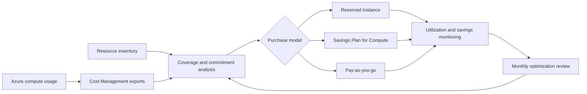

# Architecture

## Overview

The solution combines Azure cost data, workload inventory, commitment analysis, purchase governance, and ongoing monitoring.

## Main Components

1. Azure Cost Management provides usage and charge data.
2. Azure Resource Graph or inventory exports identify eligible resources.
3. Analysis scripts calculate baseline cost, expected commitment, coverage, and risk.
4. Azure Reservations and Savings Plan APIs or portal workflows support purchasing.
5. Cost Management dashboards and scheduled reviews measure results.

## Design Principles

- Commit only against demonstrated, durable usage.
- Separate technical eligibility from financial suitability.
- Preserve flexibility for workloads that may change region, family, or service.
- Review utilization and effective savings after implementation.
